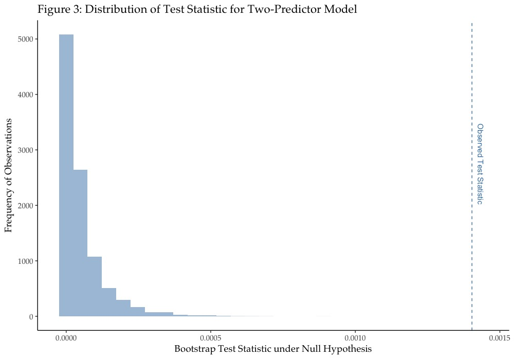
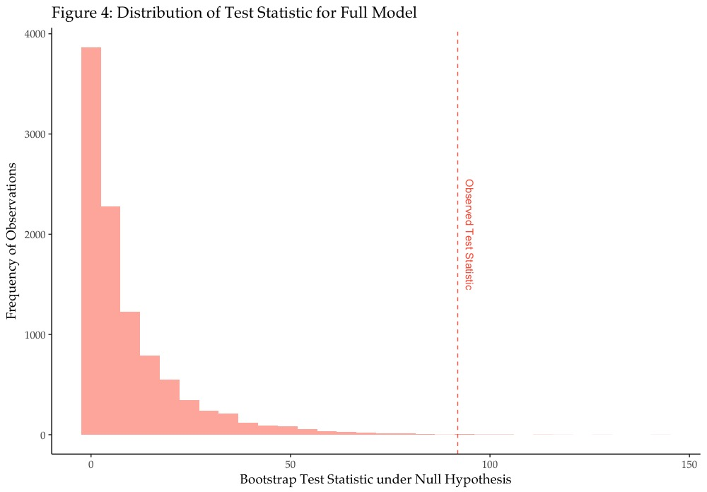

```{r, echo=TRUE, message=FALSE, warning=FALSE}

library(dplyr)
library(ggplot2)
library(boot)
library(knitr)

setwd("/Users/jh/Documents/GitHub/nonparametric-stats-bootstrap-R")

### LOAD AND EXPLORE DATA -----------------------------------------------------
# Load data (with case as row names)
data <- read.table("Abalone.txt")

# Remove rings variable from data set
data <- data[-1]

```
  
This report explores the use of various non-parametric methods to analyze characteristics of abalone sampled from the Tasmanian coastline. The data consists of physical measurements of 2,500 samples of the shell: three variables describing the size and shape of the shell, four describing the weight of the shell under various conditions, and an eighth variable indicating whether the shell belonged to an infant snail.

The sections that follow explore the data in greater detail, first examining the relationship between two variables using two different techniques, then determining the statistical significance of the variable with the weakest relationship to the outcome variable of interest, whether or not the shell belonged to an infant. Finally, the report outlines the automated selection of the best-performing model and examines the degree of certainty associated with the estimate of the intercept.

## The Relationship Between Height and Diameter

We might naturally expect that the height and diameter of the shell would be highly correlated, but determining the precise nature of the relationship between the two variables based on a sample of observations is slightly more difficult. In this section, I examine the correlation between the height and diameter of the shells using Pearson's correlation, a statistic susceptible to distortion by outliers, and Spearman's rank-based correlation, a robust alternative.

Before computing statistics that seek to describe the relationship numerically, it is often helpful to first visualize the data. Figure 1 exposes two obvious outliers present in the data. There also appears to be a fairly strong relationship between the two variables, despite the outliers. Figure 2 shows the relationship between the variables with the outliers removed where we can observe a strong, mostly linear, relationship between height and diameter.


```{r, echo=TRUE, message=FALSE, warning=FALSE, cache=TRUE, fig.keep='high', fig.height=2.5, fig.width=3.25}

ggplot(data, aes(height, diameter)) +
  geom_point(data=filter(data, height < 0.3), color='gray', size=3, alpha=0.6) +
  geom_point(data=filter(data, height > 0.3), color='dark red', size=3, alpha=0.9) +
  geom_text(data=filter(data, height > 0.3), label="Outlier", nudge_x=-0.1, size=2.5) +
  ggtitle("Figure 1: Relationship b/t Height and Diameter (w/ outliers)") +
  theme_classic(base_size=10, base_family="Palatino") +
  theme(plot.title = element_text(size = 7))

ggplot(filter(data, height < 0.3), aes(height, diameter)) +
  geom_point(alpha=0.3) +
  ggtitle("Figure 2: Relationship b/t Height and Diameter (w/o outliers)") +
  theme_classic(base_size=10, base_family="Palatino") +
  theme(plot.title = element_text(size = 7))

```

### Pearson's Correlation

```{r, echo=TRUE, message=FALSE, warning=FALSE, cache=TRUE}

### PEARSON'S CORRELATION -----------------------------------------------------
# Correlation between height and diameter
corr.p <- cor(data$height, data$diameter, method="pearson") # pearson

# Leave-one-out jackknife estimate of correlation
n <- nrow(data)
corr.p.jack <- rep(0, n)
for (i in 1:n) {
  corr.p.jack[i] <- cor(data[-i, c("height", "diameter")], 
                        method="pearson")[1,2]
}

# Jackknife estimate for SE of correlation coefficient
se.p.jack <- sqrt((n - 1) / n * sum((corr.p.jack - mean(corr.p.jack))^2))

# Normal theory confidence interval
ci.p.norm <- c(corr.p - se.p.jack * qnorm(0.975), 
               corr.p + se.p.jack * qnorm(0.975))

# Function to estimate SE using bootstrap
estimate_se_boot <- function(x1, x2, B, method='pearson') {
  # Estimate bootstrap SE for correlation coefficient
  n <- length(x1)
  corr.boot <- rep(0, B)
  for (i in 1:B) {
    idx <- sample(1:n, n, replace=T)
    corr.boot[i] <- cor(x1[idx], x2[idx], method=method)
  }
  return(sd(corr.boot))
}

# Construct bootstrapped t-distribution
B <- 10000
t.p.boot <- rep(0, B)
for (i in 1:B) {
  idx <- sample(1:n, n, replace=T)
  height.boot <- data$height[idx]
  diameter.boot <- data$diameter[idx]
  corr.p.boot <- cor(height.boot, diameter.boot, method='pearson')
  se.p.boot <- estimate_se_boot(height.boot, diameter.boot, 100, method='pearson')
  t.p.boot[i] <- (corr.p.boot - corr.p) / se.p.boot
}

# Compute SE for observed sample
se.p <- estimate_se_boot(data$height, data$diameter, 1000, method='pearson')

# Compute confidence interval
ci.p.boot <- c(corr.p + se.p * sort(t.p.boot)[B * 0.025],
               corr.p + se.p * sort(t.p.boot)[B * 0.975])

```

Pearson's correlation is arguably the most common statistic used to describe the relationship between two or more variables. It does, however, have some drawbacks. Most significantly, Pearson's correlation coefficient varies considerably in the presence of outliers.

Pearson's method describes the correlation between `height` and `diameter` as `r round(corr.p, 4)`. This indicates strong positive correlation. Unfortunately, the coefficient does not indicate the degree of uncertainty associated with the point estimate. As evidenced by Figure 1, the two outliers have likely influenced the estimate of correlation significantly.

In order to determine how closely this estimate of correlation likely matches the true correlation between all abalone height measurements and all diameter measurements in the population, I have simulated 2,500 estimates of correlation from the sample using the leave-one-out jackknife method. This method computes the correlation between the variables iteratively, each time leaving a single observation out of the sample. This provides enough variation in the estimates to enable the calculation of the standard error associated with the statistic.

The jackknife-computed standard error is `r round(se.p.jack, 4)`. With the correlation ranging from just -1.0 to 1.0, this demonstrates high uncertainty with the point estimate of `r round(corr.p, 4)`. This uncertainty is further evident through the construction of a 95% confidence interval for the correlation. Using the normal theory confidence interval, which assumes normality, the 95% confidence interval is [0.6035, 0.9981], meaning that the two variables could be anywhere from moderately correlated to almost perfectly correlated.

The assumption of normality, in this case, does not likely hold up given the presence of the outliers. Instead of constructing the interval using the critical values from a normal distribution, one can generate a distribution of test statistics from the data that requires no assumptions about the underlying distribution of the population. I computed 10,000 test statistics from bootstrapped samples of the data to form an empirical distribution from which to construct a likely more accurate confidence interval.

The bootstrap _t_-interval is [0.6722, 3.387], which extends far beyond the range of possible values for correlation, further supporting the notion that the Pearson's correlation coefficient may not accurately represent the relationship between the height and diameter of abalone shells in the full population.

```{r, echo=TRUE, message=FALSE, warning=FALSE, cache=TRUE}
### PEARSON'S CORRELATION W/O OUTLIERS ----------------------------------------
# Remove two outliers
data.exout <- filter(data, height < 0.4)

# Correlation between height and diameter
corr.p.exout <- cor(data.exout$height, data.exout$diameter, method="pearson")

# Leave-one-out jackknife estimate of correlation
n <- nrow(data.exout)
corr.p.jack.exout <- rep(0, n)
for (i in 1:n) {
  corr.p.jack.exout[i] <- cor(data.exout[-i, c("height", "diameter")], 
                              method="pearson")[1,2]
}

# Jackknife estimate for SE of correlation coefficient
se.p.jack.exout <- sqrt((n - 1) / n * sum(
  (corr.p.jack.exout - mean(corr.p.jack.exout))^2))

# Normal theory confidence interval
ci.p.norm.exout <- c(corr.p.exout - se.p.jack.exout * qnorm(0.975), 
                     corr.p.exout + se.p.jack.exout * qnorm(0.975))

# Construct bootstrapped t-distribution
B <- 10000
t.p.boot.exout <- rep(0, B)
for (i in 1:B) {
  idx <- sample(1:n, n, replace=T)
  height.boot <- data.exout$height[idx]
  diameter.boot <- data.exout$diameter[idx]
  corr.p.boot <- cor(height.boot, diameter.boot, method='pearson')
  se.p.boot <- estimate_se_boot(height.boot, diameter.boot, 100, method='pearson')
  t.p.boot.exout[i] <- (corr.p.boot - corr.p.exout) / se.p.boot
}

# Compute SE for observed sample
se.p.exout <- estimate_se_boot(data.exout$height, data.exout$diameter, 
                               1000, method='pearson')

# Compute confidence interval
ci.p.boot.exout <- c(corr.p.exout + se.p.exout * sort(t.p.boot.exout)[B * 0.025],
                     corr.p.exout + se.p.exout * sort(t.p.boot.exout)[B * 0.975])
```

It is likely that the outliers have contributed much of the uncertainty associated with Pearson's correlation coefficient. In order to examine the effect of the two outliers on the correlation estimates, I repeated the procedures described above on the data with outliers removed.

With outliers removed, the Pearson's correlation coefficient is `r round(corr.p.exout, 4)`, with a standard error of just `r round(se.p.exout, 4)`. These results demonstrate a dramatic increase in the degree of certainty with respect to the Pearson estimate of correlation. With the significantly smaller standard error, the confidence interval for the correlation estimates become [0.9045, 0.9200] and [0.9051, 0.9204] for the normal theory interval and bootstrap _t_-interval, respectively.

It is evident that the presence of just two outliers severely hindered the utility of the Pearson's correlation estimate, as there was almost no certainty associated with the estimate. With the outliers removed, the most accurate confidence interval (the bootstrap _t_-interval) ranges from just `r round(ci.p.boot.exout[1], 4)` to `r round(ci.p.boot.exout[2], 4)`, rather than extending well beyond the range of possible values as it did when outliers were present in the sample.


### Spearman's Rank-based Correlation

```{r, echo=TRUE, message=FALSE, warning=FALSE, cache=TRUE}

### SPEARMAN'S CORRELATION -----------------------------------------------------
corr.s <- cor(data$height, data$diameter, method="spearman") # spearman

# Leave-one-out jackknife estimate of correlation
n <- nrow(data)
corr.s.jack <- rep(0, n)
for (i in 1:n) {
  corr.s.jack[i] <- cor(data[-i, c("height", "diameter")], 
                        method="spearman")[1,2]
}

# Jackknife estimate for SE of correlation coefficient
se.s.jack <- sqrt((n - 1) / n * sum((corr.s.jack - mean(corr.s.jack))^2))

# Normal theory confidence interval
ci.s.norm <- c(corr.s - se.s.jack * qnorm(0.975), 
               corr.s + se.s.jack * qnorm(0.975))

# Construct bootstrapped t-distribution
B <- 10000
t.s.boot <- rep(0, B)
for (i in 1:B) {
  idx <- sample(1:n, n, replace=T)
  height.boot <- data$height[idx]
  diameter.boot <- data$diameter[idx]
  corr.s.boot <- cor(height.boot, diameter.boot, method='spearman')
  se.s.boot <- estimate_se_boot(height.boot, diameter.boot, 100, method='spearman')
  t.s.boot[i] <- (corr.s.boot - corr.s) / se.s.boot
}

# Compute SE for observed sample
se.s <- estimate_se_boot(data$height, data$diameter, 1000, method='spearman')

# Compute confidence interval
ci.s.boot <- c(corr.s + se.s * sort(t.s.boot)[B * 0.025],
               corr.s + se.s * sort(t.s.boot)[B * 0.975])


```

While it is often advisable to remove outliers from a sample prior to performing analysis, it is not always appropriate to do so as the outliers may contain critical information about the population at large. Spearman's rank-based correlation provides a robust alternative to Pearson's method without requiring the removal of outliers to produce a reliable estimate of correlation.

Spearman's method produces a correlation coefficient of `r round(corr.s, 4)`, describing a much stronger positive relationship between the variables than suggested by the Pearson's correlation coefficient with the outliers included in the sample. Because the values are converted to ranks prior to estimation, the distance between outliers and the rest of the observations becomes standardized as the outliers are simply added to the extreme ends of the sequence of ranks.

```{r, echo=TRUE, message=FALSE, warning=FALSE, cache=TRUE}
### SPEARMAN'S CORRELATION W/O OUTLIERS ---------------------------------------
# Remove two outliers
data.exout <- filter(data, height < 0.4)

# Correlation between height and diameter
corr.s.exout <- cor(data.exout$height, data.exout$diameter, method="spearman")

# Leave-one-out jackknife estimate of correlation
n <- nrow(data.exout)
corr.s.jack.exout <- rep(0, n)
for (i in 1:n) {
  corr.s.jack.exout[i] <- cor(data.exout[-i, c("height", "diameter")], 
                              method="spearman")[1,2]
}

# Jackknife estimate for SE of correlation coefficient
se.s.jack.exout <- sqrt((n - 1) / n * sum(
  (corr.s.jack.exout - mean(corr.s.jack.exout))^2))

# Normal theory confidence interval
ci.s.norm.exout <- c(corr.s.exout - se.s.jack.exout * qnorm(0.975), 
                     corr.s.exout + se.s.jack.exout * qnorm(0.975))

# Construct bootstrapped t-distribution
B <- 10000
t.s.boot.exout <- rep(0, B)
for (i in 1:B) {
  idx <- sample(1:n, n, replace=T)
  height.boot <- data.exout$height[idx]
  diameter.boot <- data.exout$diameter[idx]
  corr.s.boot <- cor(height.boot, diameter.boot, method='spearman')
  se.s.boot <- estimate_se_boot(height.boot, diameter.boot, 100, method='spearman')
  t.s.boot.exout[i] <- (corr.s.boot - corr.s) / se.s.boot
}

# Compute SE for observed sample
se.s.exout <- estimate_se_boot(data.exout$height, 
                               data.exout$diameter, 1000, method='spearman')

# Compute confidence interval
ci.s.boot.exout <- c(corr.s.exout + se.s.exout * sort(t.s.boot.exout)[B * 0.025],
                     corr.s.exout + se.s.exout * sort(t.s.boot.exout)[B * 0.975])


```

Unlike with Pearson's estimate of correlation on the sample with outliers present in the sample, Spearman's method suggests a fairly tight range of possible values between `r round(ci.s.boot[1], 4)` and `r round(ci.s.boot[2], 4)`, based on a bootstrap _t_-interval. The normal theory confidence interval is almost identical at [0.8913, 0.9112]. The tight range in the confidence interval is primarily attributed to the small standard error estimate of `r round(se.s, 4)`.

Furthermore, instead of dramatically changing the estimate of correlation as it did with Pearson's estimate, removing the two outliers from the sample has relatively little effect on Spearman's estimate of correlation and its respective confidence intervals. The estimate with outliers removed is `r round(corr.s.exout, 4)`, with 95% confidence intervals [0.8926, 0.9120] and [0.8936, 0.9142] for the normal theory interval and bootstrap _t_-interval, respectively.


## Statistical Significance of Least-Correlated Predictor

```{r, echo=TRUE, message=FALSE, warning=FALSE, cache=TRUE}
#####################
## BERNOULLI MODEL ##
#####################

## TWO PREDICTOR MODEL --------------------------------------------------------
# Remove the variable rings, using the data set with outliers removed
df <- data.exout[-1]

# Find the lowest and highest correlated predictors
corr.mat <- cor(df[1:7], y=df['infant'])
y <- df$infant
x1 <- df[, which.min(abs(corr.mat))]
x2 <- df[, which.max(abs(corr.mat))]

# Fit model with two predictors and record observed test statistic
model.full <- glm(y ~ x1 + x2, family='binomial')
T.obs.red <- (model.full$coefficients[3] - 0)^2

# Fit reduced model to obtain coefficients under null hypothesis
model.reduced <- glm(y ~ x1, family='binomial')
b0 <- model.reduced$coefficients[1]
b1 <- model.reduced$coefficients[2]

# Generate success probabilities based on reduced model
probs <- inv.logit(b0 + b1*x1)

# Simulate new data set by generating y* and generate t-distribution
n <- nrow(df)
B <- 10000
T.boot.red <- rep(0, B)
for (b in 1:B) {
  y.boot <- rbinom(n, 1, probs)
  model.full.boot <- glm(y.boot ~ x1 + x2, family='binomial')
  T.boot.red[b] <- (model.full.boot$coefficients[3] - 0)^2
}

# Calculate p-value
p.boot.red <- mean(T.boot.red >= T.obs.red)


## FULL MODEL -----------------------------------------------------------------

# Fit the full model and compute T.obs
model.full <- glm(infant ~ ., data=df, family='binomial')
T.obs.full <- (model.full$coefficients[4] - 0)^2

# Fit reduced model to obtain coefficients under null hypothesis
model.reduced <- glm(infant ~ ., data=df[-which(names(df) == 'height')], 
                     family='binomial')

# Generate success probabilities based on reduced model
probs <- inv.logit(model.reduced$fitted.values)

# Simulate new data set by generating y* and generate t-distribution
n <- nrow(df)
B <- 10000
T.boot.full <- rep(0, B)
for (b in 1:B) {
  y.boot <- rbinom(n, 1, probs)
  model.full.boot <- glm(y.boot ~ ., data=df[1:7], family='binomial')
  T.boot.full[b] <- (model.full.boot$coefficients[4] - 0)^2
}

# Calculate p-value
p.boot.full <- mean(T.boot.full >= T.obs.full)
```

Standard regression output typically indicates whether the coefficients included in the model statistically significantly influence the outcome variable of interest. However, these measures of statistical significance rely on standard distributional assumptions, namely that the error is distributed normally. This assumption is particularly important when dealing with small sample sizes. One way to test statistical significance of a coefficient without assuming that the errors are distributed normally is to utilize the bootstrap to simulate the generation of the outcome variable and observe the distribution of the test statistic.

With the abalone data set, I tested the statistical significance of the predictor that is least correlated with the outcome variable by using this distribution-free method. I first computed a correlation matrix to identify the highest and lowest correlated predictors to the outcome variable, `infant`. I then fit the resulting model, `infant ~ diameter + height`, and observed the approximated population test statistic using the coefficients from the full fitted model.

Since the objective is to simulate the observed data under the null hypothesis that the coefficient corresponding to shell height is zero, I generated a new random variable by performing an inverse logit transformation of a reduced linear model excluding shell height. Using the resulting probabilities and assuming the outcome variable has a bernoulli distribution, I formed an empirical distribution of the test statistics using 10,000 bootstrap samples. The resulting distribution is pictured in Figure 3. The observed test statistic of 0.0014 clearly falls well beyond the extreme end of the distribution of test statistics under the null hypothesis. In fact, the probability that one would observe a test statistic as extreme as this value is `r round(p.boot.red, 4)`, indicating that the coefficient associated with shell height is strongly statistically significant. Note that the asymptotic _p_-value would likely be greater than zero, but would have an extremely small value.

```{r, out.width="80%", echo=TRUE, fig.align='center', message=FALSE, warning=FALSE}

```

I also tested the significance of shell height while controlling for all of the abalone characteristics available in the data set, performing the same procedure. The resulting distribution of the test statistic under the null hypothesis is shown in Figure 4, with the observed test statistic indicated by a line. Again, with a _p_-value of 0.0014, we can conclude that shell height is statistically significant even while controlling for all of the available abalone measurements.

\vspace*{1\baselineskip}

```{r, out.width="80%", echo=TRUE, fig.align='center', message=FALSE, warning=FALSE}

```


## Automated Selection of Best Model

When building a predictive model, we are often tasked with selecting a handful of the most useful of a large set of possible predictors. In these cases, it can be helpful to begin the search for influential predictors with an automated model selection algorithm. One such algorithm, known as backward stepwise selection, begins by fitting a model with all possible predictors, then iteratively removing the predictor that contributes the least in reducing the loss function. The iterative procedure continues until the loss function can no longer be reduced by removing predictors, indicating that the optimal model has theoretically been selected. In practice, automated algorithms that greedily search the space of possible predictors, like backward stepwise selection, do not tend to select a truly optimal model. Instead, they can serve as a useful starting point, particularly when there are a large number of predictors. When performing automated model selection, one must decide which loss function to optimize. Loss functions that penalize complex models, such as AIC, BIC, or Mallow's Cp, are typically used, but one can also use a more interpretable measure such as $R^2$.

With the abalone data set, I performed backward stepwise selection to select the optimal model for predicting whether a shell belonged to an infant snail. The algorithm iteratively removed predictors that contributed the least in improving the $R^2$ value, estimated on out-of-sample data via 10-fold cross validation. The optimal model selected included all of the predictors except for the diameter of the shell. It is important to note that estimates of standard error and statistical significance are more difficult to obtain when performing model selection, as multiple tests are made using the same data without correcting for higher probabilities that one might observe a significant result through random chance.

The optimal model, `infant ~ length + height + whole + shucked + viscera + shell`, produced a cross-validated, out-of-sample $R^2$ value of 0.5313, suggesting that the model explains roughly 53% of the variation in the outcome variable.


## Analysis of the Intercept

Finally, I constructed a 95% confidence interval of the estimate of the intercept associated with the optimal model specified above, using two different methods. First, I generated 10,000 bootstrap estimates of the intercept by fitting each model using resampled indices of the data. I then constructed a 95% confidence interval of the intercept by observing the 2.5th and 97.5th percentiles of the resulting distribution of intercept estimates. Using this method, I estimated the 95% confidence interval to be [-1.0140, 0.8541].

As a point of comparison, I also generated 10,000 bootstrap estimates of the intercept using a model-based resampling method, which involves generating a new bernoulli random outcome variable using the fitted probabilities from a logistic model of the full data set, then fitting the model to the new outcome variable for each of 10,000 iterations. The 95% confidence interval, constructed using the percentile method as before, was [0.5046, 1.8348].

While the two methods produced intercept estimates in slightly shifted locations, the standard errors associated with each set of estimates were fairly similar: 0.4800 and 0.3404 for the pairwise-resampled and model-based resampled estimates, respectively. However, the model-based resampling method tended to produce more stable estimates overall.
